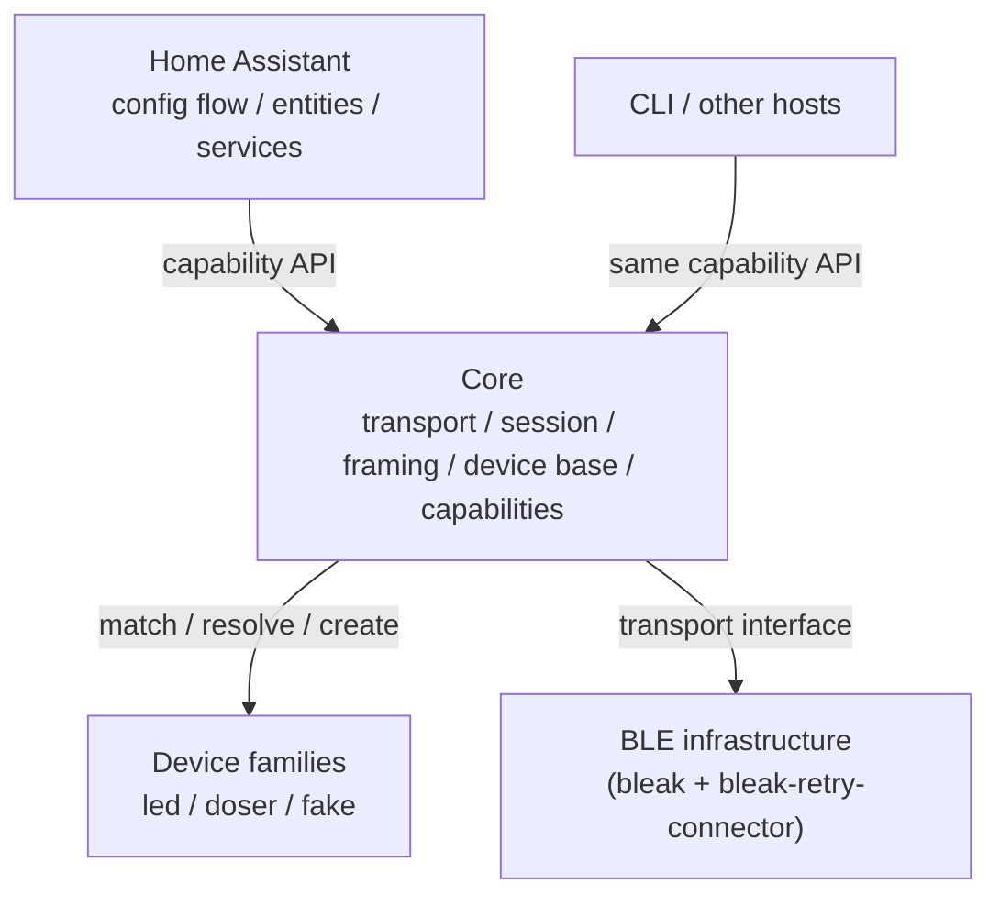

# Target architecture

## Decision summary

Split the code into three layers, from small to large:

1. **Core** (`core/`) — everything device families genuinely share: the BLE
   transport, the connect-per-transaction session (standard connection
   prelude, post-write observation window, retries), command framing and
   checksums, message IDs, typed errors, discovery/identity value types, a
   shared device base, and the capability contracts hosts consume.
2. **Device families** (`plugins/led`, `plugins/doser`) — thin modules per
   family: model descriptors, command payload bytes, notification parsing,
   and capability implementations. A family is a small plugin object with
   `match()`/`resolve_model()`/`iter_models()`/`create()`, collected in a
   tuple.
3. **Hosts** — the Home Assistant integration and the CLI. Thin adapters that
   only consume core capabilities; no host logic lives in the core.

The word *plugin* still exists, but it means exactly one thing: an object in
a statically collected tuple that matches discoveries, resolves stored model
IDs, enumerates its models, and creates devices. There is no registry, no
registration API, no runtime plugin machinery. The seam is kept because the
development fake device needs it (and it keeps the door open for real
third-party plugins later: entry-point loading would be a ~15-line addition
to the tuple constructor). Everything a heavier design adds around that seam
— a registry, API versioning, entry points, match priorities, ambiguity
rejection, per-plugin host protocols — is deliberately absent (see
"Deliberately absent").

This is a clean-break redesign. Existing public imports, config entries,
entity unique IDs, service details, and internal module layout are not design
constraints. The one-time cost is documented: existing HACS users lose entity
registry entries and restored state once, and automations referencing old
service names must be updated (release notes).

## Non-negotiable requirements

**Live demonstration of every device family without owning the hardware.**
The integration must be able to demo LED, doser, and any future family in a
running system — including the local Docker Home Assistant environment
(`dev/homeassistant/`, see `docs/home-assistant-docker.md`) and the CLI —
with zero real devices present, toggled by `CHIHIROS_FAKE_DEVICES`. This is a
hard requirement for development, demos, screenshots, and user-facing
support, not a test convenience.

Consequences that are therefore permanent design decisions, not optional
machinery:

- the fake plugin is a first-class, permanent member of the plugin tuple
  (env-gated, never default, never via entry points);
- fake devices are enumerated in the HA config flow (`async_step_user`) and
  synthesized by the CLI provider when the env var is set;
- fake config entries persist across restarts (the fake's `resolve_model`
  delegation is load-bearing, not a nicety);
- the coordinator keeps `always_available` for fake devices;
- the vendored HACS copy ships `plugins/fake` (small, env-gated);
- the fake must keep working for every family (including future ones) with
  no per-family host special cases — the same `match`/`create` seam real
  devices use.

Removing or de-scoping the fake plugin (for example making it host-side-only
or test-fixture-only) is out of scope. Its pytest-level role may overlap
with injected scripted test providers, but the live-demo role has no other
implementation.

## Why this shape fits the actual project

The code today already proves the sharing pattern:

- `ChihirosDosingPump` subclasses `ChihirosDevice` and inherits the entire
  connection lifecycle, the connection prelude (base auth + time sync), the
  post-write observation wait, retries, locks, and message ID handling; its
  only real code is `dose_ml()`.
- `protocol.py` holds the shared framing (`create_command_encoding`,
  `calculate_checksum`, `normalize_message_id`, `next_message_id`) used by
  both families.
- `commands.py` is one flat module where LED and dose commands sit side by
  side.

LED versus doser is mostly a **codec difference on one shared UART-over-BLE
protocol**. So the target shares everything BLE-shaped and only splits what
differs: payload bytes, notification parsing, and capabilities. A future
heater is a third codec, not a third framework.

## Boundaries



### Core responsibilities

Only things common to every device family:

- immutable discovery information and device identity (canonical address form);
- command framing: `create_command_encoding`, checksums, message ID
  normalization, timestamp encoding — pure functions, plus two shared
  carve-outs: the transport-level frame builders every family shares (base
  auth, time sync) and the 0x5B notification envelope parser with the
  family-independent mode-0x0A runtime frame (firmware, runtime minutes);
  families parse only their family-specific modes via a `parse_mode(mode,
  body)` hook;
- the `BleTransport` interface and its Bleak implementation;
- the shared `BleSession`: the standard connection prelude, connect per
  transaction, post-write observation window, retries and backoff, operation
  lock, notification subscription, idempotency contract, and the message ID
  counter with a session-owned draw/encode/advance loop;
- the shared `CapabilityDevice` base: snapshot storage, one-event-per-
  transaction emission, subscriber isolation, `subscribe()`;
- plugin selection: a statically collected tuple, first match wins;
- capability protocols, value types, and typed domain errors.

The core must not import `homeassistant` or Typer/Click, create HA entities,
or contain family-specific command payload bytes or capability semantics
(beyond the two carve-outs above).

### Device family responsibilities

A family module owns a complete device-family implementation:

- model descriptors (advertised name codes, channels, optional features) and
  their enumeration;
- command payload encoding and family-specific notification parsing (the
  codec), including exported golden-vector literals;
- capability implementations on top of the core session and device base,
  including each capability's own assumed-state derivations;
- family-specific validation (for example schedule duplicate-weekday
  rejection raising `ValidationError`) and protocol tests.

The LED family contains all LED model descriptors (A II, WRGB, Commander,
...). A fan on an LED is an optional `Fan` capability, not another family. A
family may contain several models; `doser` contains the dosing pump.

### Host adapter responsibilities

The HA adapter owns HA-specific concerns: config entries, the Bluetooth
discovery bridge, coordinator/availability, entities, services, translations,
and HA storage (doser daily totals). The CLI owns argument parsing, output,
and exit codes. Hosts never implement matching, encoding, or BLE logic
themselves.

Family-specific HA code that cannot be generic stays a plain module in the
integration (for example the doser daily-total storage), not a per-plugin
class hierarchy.

## The plugin seam (small on purpose)

This is the entire plugin mechanism:

```python
# core/api.py

class DevicePlugin(Protocol):
    plugin_id: ClassVar[str]
    always_available: ClassVar[bool] = False  # fake sets True; hosts consult
                                              # this instead of string-matching
                                              # plugin_id == "fake"

    def match(self, discovery: Discovery) -> PluginMatch | None: ...
    def resolve_model(self, model_id: str) -> PluginMatch | None: ...
    def iter_models(self) -> tuple[PluginMatch, ...]: ...
    def create(self, context: DeviceContext, match: PluginMatch) -> Device: ...
```

- `match()` is pure discovery matching (advertised name, address).
- `resolve_model()` turns a stored `model_id` back into a `PluginMatch`
  without a discovery. This is what makes `create_from_identity()` and the
  options flow work on HA restart: `match()` cannot run without a
  `Discovery`, and `create()` requires a `PluginMatch`, so the identity path
  needs this method. The family resolves `model_name` and its settings
  schema from the model descriptor table; hosts never persist display names.
- `iter_models()` is the static catalog of the family's `PluginMatch`
  entries. It exists for the HA manual-add step and the CLI's
  `--plugin/--model` override (hosts cannot import family modules, and
  `resolve_model()` cannot enumerate), and for the manifest-matcher sync
  test.
- `create()` is synchronous and cheap; BLE connection happens lazily via the
  context's transport factory.
- `always_available` declares that the plugin's devices never advertise
  (today: the fake). The coordinator uses it instead of string-comparing
  plugin IDs.

```python
# plugins/__init__.py — the whole "registry", built statically

def builtin_plugins() -> tuple[DevicePlugin, ...]:
    """Deterministic order: fake first when enabled, then led, then doser."""
    plugins: list[DevicePlugin] = [led.plugin, doser.plugin]
    if fake.enabled():          # CHIHIROS_FAKE_DEVICES
        # Constructed with its family catalog so family order lives in one
        # place.
        plugins.insert(0, fake.FakePlugin(families=tuple(plugins)))
    return tuple(plugins)
```

There is deliberately **no `registry.py`** and no `register()` API. The fake
is a conditional tuple member — an env-gated include, not a runtime
registration — which gives the development workflow with zero API surface, no
ordering rules to document, and no reload hazard (module import happens once
per process; HA reload re-runs `async_setup_entry`, not `__init__`). When a
real external plugin appears, load its entry points into this tuple; no API
change is needed. Manager and host tests inject their own plugin tuples, so
they do not need a registry either.

Rules:

- matching is pure (no BLE connection) and deterministic: plugins are asked
  in tuple order, **first match wins**; within a family, longest
  advertised-code prefix first, as in the current `models.py`. Ties between
  families are impossible in practice because advertised prefixes are
  disjoint; a test enforces that (see Tests), so a tie is a test bug, not a
  runtime state. The manager's discovery-fed `match()` additionally rejects
  `connectable=False` discoveries before consulting any plugin (a universal
  rule, enforced once, not per family). The explicit-address path
  (`create_from_address`) does **not** apply the connectable rule: the user
  has chosen to connect, and the connect attempt itself is the arbiter of
  connectability.
- no `api_version`, no match priorities, no module scanning;
- `plugin_id` is a stable string stored in config entries
  (`"led"`, `"doser"`, `"fake"`).

### The fake development plugin

The fake device is the reason the seam exists, and the live-demo requirement
above makes it permanent. It has three parts:

1. **Matching by exact inventory, delegating to the real family.** The fake
   plugin owns a small inventory of fake devices (mirroring today's
   `custom_components/chihiros/fake.py` list, plus a Commander fake — see
   below), keyed by exact canonical addresses (`FA:CE:C0:00:00:01`, ...).
   Exact-address matching only: never a `FA:CE:C0` prefix rule (which could
   shadow a real device in dev environments) and never name matching (fake
   names start with real advertised codes such as `DYNW60-fake`, so a name
   matcher would lose to the LED family's prefix matcher — which is why the
   fake sits first in the plugin tuple). Inventory entries carry the real
   family `model_id` (name is display-only), and both `match()` and
   `resolve_model()` delegate the same way: a flat lookup in the injected
   families' `iter_models()` catalog, re-stamped `plugin_id="fake"`. This
   delegation is deliberately kept (a few lines) so dev config entries
   survive HA restarts — the alternative (entry-less fake devices) would be
   more host machinery than the delegation saves. `create()` resolves its
   delegate the same way and builds the real family device over a fake
   transport.
2. **A fake transport over a scripted emulator, not a fake device.**
   `create()` calls the real family's `create()` with a `transport_factory`
   returning an in-memory `FakeTransport` (implements `BleTransport`) paired
   with a `FakeDeviceServer`. The server is deliberately **not** a wire-level
   emulator (today's `fake.py` mirrors the capability API and contains no
   bytes; a reverse command decoder would be a second wire implementation
   whose only consumer is a dev-only test double — YAGNI). Instead, the
   server matches each received write frame against the family codec's
   exported golden-vector literals by **byte equality with the message-ID
   bytes (indices 3–4) and the trailing checksum masked**, plus an
   independent checksum recomputation from the received frame (pure
   arithmetic, not a decoder). Golden vectors are hardcoded literals
   exported from the family codec modules (one owner, imported by both the
   golden-vector tests and the fake server), written with a fixed message ID
   and the fake's fixed clock; live frames match regardless of the session's
   counter, and a checksum-collision re-encoded frame still matches. A
   broken encoder changes the parameter bytes, the lookup fails loudly (a
   mismatched frame raises a clear error — never silent ignore), and the
   real `parse_notification()` path turns the scripted response frames into
   snapshots. The server exposes a scripting API: `emit(frame, delay=0)`
   (thread-safe; tests may call it from a worker thread to exercise the
   thread contract), `fail_next_write()`, `fail_write(index)` (fail the Nth
   frame of the next transaction — needed for the replace partial-failure
   test), and `drop_after_write()` (deliver the write, then simulate an
   unexpected disconnect — the ambiguous-outcome scenario that justifies the
   non-idempotency contract).
3. **Host-side discovery synthesis.** A fake is never advertised, so hosts
   synthesize `Discovery` objects for the fake inventory and feed them
   through the same `match()`/`create()` path. The fake plugin module owns
   the shared helpers — `enabled()` (env check), the plugin instance, and
   `iter_synthetic_discoveries(configured_addresses)` (inventory minus
   already-configured entries, each `Discovery` with `connectable=True` —
   the host has chosen to connect). The CLI provider's `scan()` and
   `get_discovery()` merge them when enabled; the HA config flow enumerates
   them in `async_step_user` when enabled. Hosts each write a one-line call;
   there is no third copy of the inventory or env logic.

The special case therefore shrinks from device-layer `is_fake` flags
(today's `discovery.py`) to host-side enumeration of synthetic discoveries.
Matching, creation, and the core have zero fake awareness; the fake's
`always_available=True` is a plugin-declared fact, not a string check.

The dev list includes a Commander fake (`DYCOM-fake` with a required
`device_type` setting) and the doser fake carries the `pump_count` setting,
so the settings-schema rendering, the options flow, and the
`SettingsRequiredError` path are exercisable end-to-end without hardware —
the other fakes match with empty schemas.

The fake is never included unless `CHIHIROS_FAKE_DEVICES` is set and never
loads through entry points. The vendored HACS copy keeps `plugins/fake` (it
is small and env-gated, and keeping one source of truth beats a second
host-side fake) — required by the live-demo requirement, not optional.
Acceptance: with `CHIHIROS_FAKE_DEVICES` set in the Docker HA environment,
the config flow must offer every fake device in the inventory, and adding
one must create working entities for its family with no real hardware
attached.

### When the seam grows

- **Third-party plugins, CLI only**: entry-point loading is a ~15-line
  addition to `builtin_plugins()`. Import failures of optional entry-point
  plugins are logged and skipped; a broken *built-in* family is a programming
  error and fails loudly. Note that entry points open the door for the CLI
  and other hosts only — Home Assistant discovery is gated by the static
  `manifest.json` bluetooth matchers before `match()` ever runs, so an
  external plugin in HA always requires a manifest update and a HACS release;
  the manifest sync test is the enforcement. Do not build either mechanism
  before a concrete external plugin exists.
- **A protocol-different device family** (different transport or framing)
  gets a session variant alongside the shared one. Capability contracts are
  unaffected, so hosts are unaffected.

## Stable core interfaces

### Value types and errors

```python
# core/api.py — value types, errors, capability protocols, DevicePlugin

class DeviceError(Exception): ...            # base for all device failures
class DeviceNotFoundError(DeviceError): ...
class DeviceUnavailableError(DeviceError): ...
class OutcomeUnconfirmedError(DeviceUnavailableError): ...
    # a non-idempotent transaction failed after its first write; the device
    # may or may not have applied the command (see Transaction contract)
class CapabilityError(DeviceError): ...      # operation failed on the device
class ValidationError(CapabilityError): ...  # invalid host input
class ProtocolError(DeviceError): ...        # framing, checksum, parse failures
class SettingsRequiredError(DeviceError): ...  # create() needs missing or
                                              # unknown settings; carries the
                                              # offending keys
class PluginError(Exception): ...            # plugin loading/selection failures

@dataclass(frozen=True, slots=True)
class Discovery:
    address: str                 # canonical: uppercase, colon-separated
    name: str | None
    connectable: bool            # host-observed; discovery-fed matching
                                 # rejects non-connectable discoveries
```

No bleak types appear in core value types: the transport seam is the only
place bleak is named (see Transport and session). The CLI avoids a second
scan by caching resolved devices inside its provider, not inside the value
type. No advertisement payload fields (`service_uuids`,
`manufacturer_data`, ...) are part of the contract today: matching is
name-prefix based (plus the fake's exact-address rule), and the HA bridge
already holds the raw `BluetoothServiceInfoBleak` if a future matcher ever
needs more. Adding a field to this frozen dataclass later is a one-line
change.

`Discovery.address` is canonical by construction: the core normalizes
scanner-reported and user-supplied addresses at every public `DeviceManager`
entry point (`match`, `create`, `resolve_address`, `create_from_address`,
`create_from_identity`), and hosts never format addresses themselves. The HA
discovery bridge canonicalizes before the config flow stores anything, so
`async_set_unique_id` always receives the canonical form. A test feeds
deliberately non-canonical input (lowercase, unseparated) and asserts the
canonical identity and derived unique IDs stay stable.

```python
@dataclass(frozen=True, slots=True)
class SettingSpec:
    """One plugin setting; the single source for config-flow and CLI forms.

    No label: HA renders via strings.json translation keys mapped by setting
    key; the CLI prints the key.
    """

    key: str
    kind: Literal["select"]        # "select" today: Commander device_type,
                                   # doser pump_count
    choices: tuple[str, ...] = ()
    default: object = None
    required: bool = False

@dataclass(frozen=True, slots=True)
class PluginMatch:
    plugin_id: str
    model_id: str
    model_name: str                       # for the config flow's device list
    settings_schema: Mapping[str, SettingSpec] = field(default_factory=dict)

@dataclass(frozen=True, slots=True)
class DeviceIdentity:
    address: str          # canonical: uppercase, colon-separated
    name: str | None      # None until first observed; not persisted
    plugin_id: str
    model_id: str

@dataclass(frozen=True, slots=True)
class DeviceEvent:
    """Bare marker: a transaction completed.

    Deliberately carries no fields. There are at most a handful of
    capabilities per device, so subscribers re-read every capability snapshot
    on any event; a string key could not be resolved to a capability protocol
    anyway (lookup is type-based). Emission is transaction-scoped and owned
    by the shared device base: exactly one event per completed transaction
    (send/query/refresh), emitted unconditionally — HA's state machine
    dedupes identical writes, so suppressing no-change events would buy
    nothing — with trailing observation-window frames naturally coalesced
    (the event fires when the awaited session call returns, after the window
    has elapsed).
    """

@dataclass(frozen=True, slots=True)
class DeviceContext:
    """Lazy construction context passed to `DevicePlugin.create`."""

    address: str                          # canonical identity form
    settings: Mapping[str, object]        # values validated by the plugin
    transport_factory: Callable[[], BleTransport]  # closes over the host
                                                   # provider; resolves the
                                                   # address at connect time
    timings: SessionTimings = SessionTimings()     # family create() passes
                                                   # this to BleSession
    now: Callable[[], datetime] | None = None      # clock for the prelude;
                                                   # the fake supplies a fixed
                                                   # clock so prelude golden
                                                   # vectors are deterministic
```

Config entries, entity unique IDs, and storage keys all derive from the
single canonical address form.

`settings_schema` replaces the old `required_settings` name list: hosts can
render and validate the Commander `device_type` and doser `pump_count` forms
without hardcoding per-key knowledge, and the same schema drives the CLI's
`--setting` options. Hosts derive defaults from the schema
(`settings_schema["pump_count"].default`) — no host-side copies of plugin
defaults or normalizers. A `"number"` kind is deliberately absent until a
numeric setting exists (YAGNI; it would need min/max/step to render an HA
form anyway). Settings a host omits fall back to documented plugin defaults,
so `create()` never fails just because an optional setting is missing.

```python
class Weekday(enum.IntEnum):
    """The single name<->int owner for schedule weekdays.

    1=Monday ... 7=Sunday (datetime.isoweekday convention). Both hosts
    import this; only the family codec converts to the wire bitmask
    (Monday=64 ... Sunday=1).
    """

    MONDAY = 1
    TUESDAY = 2
    WEDNESDAY = 3
    THURSDAY = 4
    FRIDAY = 5
    SATURDAY = 6
    SUNDAY = 7
```

### Capabilities

Capabilities are the host-facing contract, marked `@runtime_checkable` (so
`isinstance` lookup works). Hosts look them up by protocol type
(`device.capability(Light)`), never by string or by model class. An
unsupported capability returns `None` — there are no `has_*` flags. A
conformance test (see Tests) sweeps every family's devices and asserts
structural conformance to every declared capability protocol plus `key`
uniqueness, and a contract test pins `Capability.key ==` the lowercased
protocol class name (for example `Light.key == "light"`) — the keys embedded
in unique IDs cannot drift silently.

```python
class Capability(Protocol):
    """Stable, host-facing contract for one device feature."""

    key: ClassVar[str]  # stable string for events, logs, and unique IDs

@dataclass(frozen=True, slots=True)
class Channel:
    key: str
    label: str          # English display text; hosts may translate
    index: int
    group: str | None = None  # entities are keyed by group, not channel

@dataclass(frozen=True, slots=True)
class LightState:
    """Light snapshot. Assumed state: the protocol never reports levels or
    on/off, so the family derives this from writes (see derivations below)."""

    on: bool | None
    levels: Mapping[str, int] | None    # Channel.key -> level

class Light(Capability, Protocol):
    key: ClassVar[str] = "light"
    channels: tuple[Channel, ...]
    state: LightState | None

    async def set_levels(self, levels: Mapping[str, int]) -> None: ...
    async def turn_on(self) -> None: ...
    async def turn_off(self) -> None: ...
```

`Channel.group` expresses entity grouping: a unified RGB/RGBW entity is one
group (`group="rgb"`), per-channel entities are one group per channel
(white-only models). HA creates one entity per group — this preserves today's
single-entity RGB design and avoids the per-channel write collisions that
motivated it, while keeping the generic entity code model-free.

**Assumed-state derivations are family-owned.** Each capability
implementation declares its own write → state derivations on the device base
(a small hook the base invokes after each transaction; the base itself only
stores snapshots and emits events). The LED family declares, each rule
with a test: `set_levels`/`turn_on`/`turn_off` update `LightState`;
`Light` writes clear `LightMode.auto` to `False`; `set_auto(True)` sets it;
`set_speed` updates `FanState.speed_percent` immediately and a fan-status
notification does not clobber it. A stability test per family asserts the
negative direction too: unrelated notifications (runtime, schedule) never
change assumed state. Hosts treat `None` as unknown and must not re-derive
assumed state themselves. Because `LightState` is assumed, HA entities
restore last levels across restarts via `RestoreEntity` (as today) — the
reboot snap is avoided without any wire query.

```python
class LightMode(Capability, Protocol):
    key: ClassVar[str] = "light_mode"
    auto: bool | None            # derived/assumed, see derivations

    async def set_auto(self, enabled: bool) -> None: ...

@dataclass(frozen=True, slots=True)
class FanState:
    """Observed fan snapshot; None fields mean unknown."""

    speed_percent: int | None      # assumed, see derivations
    rpm: int | None                # observed (fan status notification)
    temperature_celsius: float | None

class Fan(Capability, Protocol):
    key: ClassVar[str] = "fan"
    state: FanState | None

    async def set_speed(self, speed_percent: int) -> None: ...

@dataclass(frozen=True, slots=True)
class SchedulePoint:
    """One schedule entry: the add payload and the snapshot entry."""

    start: str                    # "HH:MM"
    end: str                      # "HH:MM"
    levels: Mapping[str, int]     # Channel.key -> level
    weekdays: tuple[Weekday, ...] | None = None  # None = every day; a tuple,
                                                 # not a set, so duplicates
                                                 # are representable and the
                                                 # family's duplicate-weekday
                                                 # validation has meaning
    ramp_minutes: int = 0

@dataclass(frozen=True, slots=True)
class ScheduleKey:
    """The reduced delete key the wire command needs (no levels)."""

    start: str
    end: str
    weekdays: tuple[Weekday, ...] | None = None
    ramp_minutes: int = 0

@dataclass(frozen=True, slots=True)
class ScheduleSnapshot:
    points: tuple[SchedulePoint, ...]

class Schedule(Capability, Protocol):
    key: ClassVar[str] = "schedule"
    state: ScheduleSnapshot | None    # observed (schedule snapshot notification)

    async def add(self, point: SchedulePoint) -> None: ...
    async def remove(self, key: ScheduleKey) -> None: ...
    async def replace(self, points: Sequence[SchedulePoint]) -> None: ...
    async def reset(self) -> None: ...
```

The wire protocol deletes a schedule point by its reduced key (times, ramp,
weekdays — brightness slots are padding in the delete command), so
`remove(key)` mirrors today's `remove_schedule` service and needs no prior
snapshot. Duplicate-weekday validation lives in the family device and raises
`ValidationError`. **The `Schedule` implementation performs a trailing
`Device.refresh()` after every mutation itself** (it owns both the mutation
and `refresh()` on the device base), so hosts do not duplicate that policy —
this does not contradict the session-level "no automatic follow-up" rule,
which is scoped to the session.

```python
class Doser(Capability, Protocol):
    key: ClassVar[str] = "doser"
    channel_count: int

    async def dose(self, channel: int, volume_ml: float) -> None: ...
```

`Doser.dose` takes **1-based, user-facing channel numbers** (the CLI's
`--channel 1..4` and the HA service already use 1-based; the codec subtracts
one when encoding). `channel_count` comes from the doser family's `pump_count`
setting (`select`, choices 2/4 — today's `PUMP_COUNT_OPTIONS`); hosts size
entity loops from `capability(Doser).channel_count` and derive the default
from the schema. `Doser` is the one action-only capability: it has no
snapshot and emits no events; its HA side effects (daily totals, restored
dose volumes) are storage-backed and bypass the coordinator, exactly as
today.

```python
@dataclass(frozen=True, slots=True)
class DiagnosticsState:
    """Observed device telemetry; None fields mean unknown. Data only —
    hosts render display text (as today's coordinator does)."""

    firmware_version: str | None
    runtime_minutes: int | None
    notification_mode: int | None     # last notification mode byte
    raw_payload: bytes | None         # last raw notification, for debugging

class Diagnostics(Capability, Protocol):
    key: ClassVar[str] = "diagnostics"
    state: DiagnosticsState | None
```

`FanState`, `ScheduleSnapshot`, and `DiagnosticsState` exist because the
sensor platform is capability-driven too: today's firmware, schedule-point,
fan RPM/temperature, and last-notification sensors all come from parsed
notifications, and a capability without a snapshot can never emit a
`DeviceEvent`.

There is deliberately **no `Heater` capability and no `heater` CLI command**
in this design: no real heater protocol implementation exists, and guessing
the contract (units, hysteresis, calibration) before a single byte exists is
exactly the speculative machinery this document forbids. When a real heater
protocol arrives, it is one dataclass + one protocol + one family, like any
other.

### The shared device base

```python
# core/device.py

class CapabilityDevice:
    """Shared base: snapshot storage, subscribe(), transaction-scoped
    event emission, and subscriber isolation.

    Families subclass this and implement capability logic (including their
    own assumed-state derivations). The base provides the generic mechanism
    only: snapshots live here and one DeviceEvent is emitted per completed
    transaction.
    """

    identity: DeviceIdentity

    def capability(self, capability_type: type[C]) -> C | None: ...
    def capabilities(self) -> Sequence[Capability]: ...
    def subscribe(self, callback: Callable[[DeviceEvent], None]) -> Callable[[], None]: ...
    async def refresh(self) -> None: ...
    async def disconnect(self) -> None: ...
```

`capabilities()` exists so hosts can enumerate what a device reports (the
CLI's `device info` renders it) without maintaining a second copy of the
capability catalog. `refresh()` is the explicit state-query mechanism: one
status-query transaction and exactly one `DeviceEvent`; families with no
query frame and no snapshots implement it as an observe-only transaction or a
no-op. Subscriber callbacks are isolated: a raising subscriber is logged and
skipped, remaining subscribers still receive the event, and the transaction
completes normally.

### Device and manager

```python
class DiscoveredDevice(NamedTuple):
    discovery: Discovery
    match: PluginMatch | None     # None = unmatched; --all renders them

class DeviceManager:
    """Concrete class (a Protocol earns its keep only for interfaces that
    multiply: BleTransport, BleDeviceProvider, DevicePlugin). Test doubles
    inject providers, transports, and plugin tuples through the real
    manager."""

    async def discover(self, timeout: float = 5.0) -> tuple[DiscoveredDevice, ...]: ...
    def match(self, discovery: Discovery) -> PluginMatch | None: ...
    async def resolve_address(self, address: str) -> tuple[Discovery, PluginMatch]: ...
    def create(
        self,
        discovery: Discovery,
        settings: Mapping[str, object],
    ) -> Device: ...
    def create_from_identity(
        self,
        identity: DeviceIdentity,
        settings: Mapping[str, object],
    ) -> Device: ...
    async def create_from_address(
        self,
        address: str,
        settings: Mapping[str, object],
    ) -> Device: ...
```

Validation boundary (one owner each): the manager checks the plugin's
`settings_schema` structurally — required keys present, and **no unknown
keys** (a typo'd optional key must not silently fall back to the default) —
and raises `SettingsRequiredError` (carrying the offending keys) otherwise;
the plugin validates setting *values* in `create()` and raises
`ValidationError`. Hosts render the schema to collect settings; they never
validate themselves.

- `discover()` scans through the host `BleDeviceProvider` and returns every
  discovery with its match (or `None` for unmatched). It creates nothing —
  rendering needs only `DiscoveredDevice` (model name and settings schema are
  already there), and creating every match would abort the listing on the
  first settings-bearing model.
- `match()` is pure and rejects non-connectable discoveries first (discovery-
  fed paths only; the explicit-address path bypasses the connectable rule).
  The old automatic `FALLBACK` model is not carried over; unknown devices are
  offered only through an explicit manual-add step (see HA design) or the
  CLI's `--plugin/--model` override.
- `resolve_address()` is the match-first address path: canonicalize, then
  `provider.get_discovery(address)` (which merges fakes when enabled), then
  `match()`. It raises `DeviceNotFoundError` when the device is invisible or
  when no plugin matched. `create_from_address()` is `resolve_address()` +
  `create()`; the CLI's `device info` consumes `resolve_address()` directly.
  One resolution path owns canonicalization, fake merging, and error mapping
  — hosts never hand-roll it.
- `create_from_identity()` rebuilds a device from a stored config entry
  without a live advertisement: the manager looks the plugin up by
  `identity.plugin_id`, calls `plugin.resolve_model(identity.model_id)`, and
  creates. An unknown `plugin_id` or `model_id` raises `DeviceNotFoundError`
  so hosts can flag stale entries.
- The HA integration never calls `discover()`; its stack scans passively and
  feeds `match()` through the discovery bridge.

### Transport and session (the shared protocol logic)

```python
class BleTransport(Protocol):
    """Hides Bleak; bound to one canonical address.

    Error contract: transient connection, service-resolution, and write
    failures raise DeviceUnavailableError (retryable — service resolution is
    retried internally, as bleak-retry-connector does today); ProtocolError
    is raised only pre-write, when services resolved but the UART
    characteristic is missing (fatal, never retried).
    """

    async def connect(self) -> None: ...
    async def disconnect(self) -> None: ...
    async def write(self, payload: bytes) -> None: ...
    def subscribe(self, callback: Callable[[bytes], None]) -> Callable[[], None]: ...
    def on_disconnect(self, callback: Callable[[], None]) -> Callable[[], None]: ...

class BleDeviceProvider(Protocol):
    """Host-provided BLE infrastructure seam. bleak types appear here and in
    bleak_transport.py only — never in core value types."""

    async def get_ble_device(self, address: str) -> BLEDevice | None: ...
    async def get_discovery(self, address: str) -> Discovery | None: ...
    async def scan(self, timeout: float) -> tuple[Discovery, ...]: ...
```

Home Assistant implements the provider with
`bluetooth.async_ble_device_from_address(hass, address, connectable=True)`
plus the passive registry (so connection slots and ESPHome proxies are
respected); the CLI implements it with `BleakScanner` and caches resolved
devices internally so address commands never scan twice (the cache entry is
dropped when a connect attempt fails, so retries get a fresh lookup).
`get_discovery()` feeds matching (`resolve_address`); `get_ble_device()`
feeds bleak-retry-connector's `ble_device_callback`: the transport re-runs
it on every connect attempt so connector retries always use a fresh
advertisement (in HA this is a registry lookup, so it is cheap). The
`on_disconnect` callback delivers unexpected disconnects to the session —
this is the channel that makes the ambiguous-outcome contract observable
(today's client has the same `_disconnected` callback). `BleakClient` and
GATT characteristics never escape the transport.

The vendored transport may only use the bleak/bleak-retry-connector API
surface present in the **minimum supported Home Assistant version**, which is
decided in implementation step 1 and declared in `hacs.json` and the docs. A
dedicated CI job runs the transport/session tests against `homeassistant`
pinned to exactly that minimum version (not latest); the CLI's bleak and
bleak-retry-connector pins are upper-bounded to the surface HA provides at
that version. New code imports only public bleak/bleak-retry-connector names
(no `bleak.backends.*` internals).

```python
@dataclass(frozen=True, slots=True)
class SessionTimings:
    observe: float = 0.5          # post-write observation window
    quiet_period: float = 0.5     # query() silence threshold
    refresh_quiet_period: float = 1.0   # matches today's STATUS_NOTIFICATION_WAIT
    timeout: float = 2.0
    attempts: int = 3             # connect/prelude retry cap (today's DEFAULT_ATTEMPTS)
    backoff: float = 0.25         # unconditional between session retries

Encoder = Callable[[tuple[int, int]], tuple[bytes, tuple[int, int]]]
    # one frame per call: draw -> encode -> advance is the session's loop

class BleSession:
    """Shared connect-per-transaction logic, used by every family.

    Owns the operation lock, retries/backoff, the message ID counter (and
    its draw/encode/advance loop), the standard connection prelude, and
    notification forwarding. Knows nothing about LED or doser command
    payloads.
    """

    def __init__(
        self,
        transport: BleTransport,
        *,
        timings: SessionTimings = SessionTimings(),
        now: Callable[[], datetime] = datetime.now,   # injectable for tests
    ) -> None: ...

    async def send(
        self,
        encoders: Sequence[Encoder],
        *,
        idempotent: bool,
    ) -> None: ...
    async def query(
        self,
        encoder: Encoder,
        *,
        quiet_period: float | None = None,   # None = timings default
    ) -> None: ...
    def subscribe(self, callback: Callable[[bytes], None]) -> Callable[[], None]: ...
```

**The standard prelude.** The sequence every family sends on connect — base
auth plus two time-sync commands — is a session contract, not a family
detail: `BleSession` sends it on every connect, drawing fresh message IDs
from its own counter and the injectable clock (so prelude bytes are
deterministic in tests). The frame builders live in `core/framing.py` (the
shared transport-level carve-out) and their exact bytes are pinned by golden
vectors. A protocol-different family gets a session variant; no family
re-declares the prelude.

**Connection sequence on every connect attempt:**

1. `transport.connect()` (resolves the address through the provider via the
   `ble_device_callback`; connect failures retry with backoff up to
   `timings.attempts` — nothing has been written yet, so retries cannot
   duplicate an effect);
2. **prelude** — base auth + two time-sync frames, before any transaction
   frames. Without this, devices stop accepting commands. (The base-auth
   frame doubles as a status request: it can elicit a runtime notification
   right after connect; that frame is forwarded like any other.)
3. transaction frames are written with the retry policy;
4. **observation window** — the connection stays open for `timings.observe`
   seconds after the last write (today's `COMMAND_NOTIFICATION_WAIT = 0.5`).
   This is how push-only states (fan status, schedule snapshot) stay fresh —
   `set_fan_speed` or `add` never elicit those frames via a query;
5. disconnect.

**Notification forwarding is transport-lifetime**: every frame received from
`transport.connect()` to disconnect is delivered to subscribers — including
prelude-triggered frames before the observation window opens. The observation
window governs only how long the connection is held, not what is delivered.
This matches today's client, which starts notifications before the prelude.

**Message IDs.** The draw/encode/advance loop is session-owned and atomic
under the operation lock: for each encoder — draw `msg_id`, encode (the
codec returns the effective wire ID alongside the frame, because checksum
collision avoidance can re-encode with a different ID), advance the counter
to the effective ID, next. **On retry, the session re-runs the whole encoder
list with fresh draws**, so retried frames are re-encoded rather than
replayed stale bytes (today's client replays pre-encoded bytes — a latent
wire-ID reuse this design fixes). The pinned invariant is that wire IDs are
strictly increasing in draw order across the device's lifetime. Families
never touch the counter directly — they supply pure per-frame encoders, and
the codec pattern's `encode_*` functions are exactly `Encoder`s.

**Transaction contract:**

- connect and prelude failures are retried with unconditional backoff
  (`timings.backoff` between session retries, up to `timings.attempts`) —
  they happen before any transaction frame is written, so a retry cannot
  duplicate an effect. This applies to non-idempotent transactions too (it
  deliberately improves today's dose `retry=1`, which even skipped
  connect-failure retries).
- once the first transaction-frame write is attempted, the transaction is
  **idempotent** (retries normally, re-encoding frames with fresh IDs) or
  **non-idempotent** (never replayed: a disconnect after the final write is
  ambiguous — the device may already have applied the command).
- An unexpected disconnect (via the transport's `on_disconnect`) after the
  first transaction-frame write of a non-idempotent transaction raises
  `OutcomeUnconfirmedError` — the host-facing "the device may or may not
  have applied it" signal. The CLI prints its outcome-unconfirmed hint only
  on this typed error, never on a command-name table.
- **`Doser.dose` is non-idempotent** (keeps today's `retry=1` rule).
- **`Schedule.add` and `Schedule.replace` are classified non-idempotent**
  (never replayed once any add frame is written). Both are marked *pending
  hardware verification*: today's integration validation stores one period
  per weekday, which may make a replayed add overwrite its own slot
  (effect-idempotent); if hardware verification shows that, `add` is
  reclassified idempotent and keeps retries. Until then, never replay.
  `replace` composes as reset + one add per point (the wire has no
  replace-all command) and the family device compensates on partial failure
  with a reset, exactly as today's `async_replace_schedule` does — accept
  that an aborted replace leaves the schedule emptied (documented UX).
- All other LED writes (`set_levels`, `turn_on/off`, `set_auto`,
  `set_fan_speed`, schedule remove/reset) are idempotent. The family's
  `device.py` classifies each operation explicitly at the `send()` call
  site; the blanket claim "all LED writes are idempotent" must not be
  codified.

**State updates.** There is no automatic status query after transactions in
the session itself; state arrives via the observation window (pushed
notifications) and the family-owned assumed-state derivations. The
`Schedule` capability refreshes after its own mutations; sensor updates and
availability recovery refresh on their own cadence. `Device.refresh()` is
the single query mechanism; persistent connections remain a possible later
optimization and must not change the capability contract.

**Thread contract.** Notification callbacks may arrive on a bleak worker
thread. Core guarantees: snapshots are atomic replacements of frozen
dataclasses (safe to read from any thread); `query()`'s quiet-period waiter
is woken via `loop.call_soon_threadsafe`; hosts marshal events onto their own
loop defensively. A session-level test delivers frames from a real worker
thread during `send()`/`query()` and asserts the waiter wakes and subscribers
receive the frames.

`send()` is fire-and-write with the observation window. `query()` is
`send()` plus collection: it waits until a quiet period (no frames for
`quiet_period`) or `timeout`, then returns. The quiet timer **resets on
every received frame** (multi-frame responses that arrive slowly are not cut
off) and a sustained frame stream terminates exactly at `timeout`.
Notifications carry no request correlation, so "the response" is
deliberately defined as "everything observed until silence". All collected
frames are delivered to subscribers — the family's parser updates snapshots
from every frame, and that is the only parsing path; `query()` returns
nothing (its return value would have no production consumer). **Zero
collected frames is not an error**: silence is normal for a healthy device.
`Device.refresh()` uses `timings.refresh_quiet_period` (≈1.0 s, matching
today's `STATUS_NOTIFICATION_WAIT`).

**Framing details that must survive the refactor:**

- `create_command_encoding` changes signature to
  `-> tuple[bytes, tuple[int, int]]` (frame + effective wire ID), and the
  prelude builders return the same shape so the session's counter stays
  correct.
- `create_command_encoding` sanitizes reserved parameter bytes (`0x5A`) by
  default — but this is a per-command flag: `create_manual_dose_command`
  passes `avoid_reserved_byte=False` because 9.0 mL encodes to tenths 90 =
  `0x5A`, and sanitizing it would silently dose 8.9 mL. The framing module
  documents both the parameter sanitization and the per-command escape
  hatch, with a golden-vector test for a dose volume containing `0x5A`.
- the 0x5B notification envelope is parsed in core into `(mode, body)`;
  families implement `parse_mode(mode, body)` for their own modes (fan
  0x0B, schedule 0xFE); the mode-0x0A runtime frame is family-independent
  and parsed in core. Golden vectors pin the prelude bytes, the timestamp
  encoding, and the runtime frame extraction. Malformed, unknown-mode, and
  truncated frames are silently ignored (never raise from the parser).
- weekday bitmask encoding (Monday=64 ... Sunday=1 on the wire) lives in the
  LED codec, converting to/from the `Weekday` enum; golden-vector tests pin
  the conversion.

### Codec pattern

A family codec stays pure and independently testable. Stateless module-level
functions are fine (KISS); the boundary that matters is that protocol code is
never called from HA or CLI code directly.

```python
# plugins/led/codec.py

def encode_set_levels(msg_id: tuple[int, int], levels: Mapping[str, int]) -> tuple[bytes, tuple[int, int]]:
    """One channel frame. Families expose per-frame Encoders exactly matching
    the session's draw/encode/advance loop; a multi-channel command is a
    tuple of Encoder closures."""

def encode_query_status(msg_id: tuple[int, int]) -> tuple[bytes, tuple[int, int]]: ...

def parse_mode(mode: int, body: bytes, channels: Sequence[Channel]) -> LedNotification | None: ...

# Golden-vector literals (fixed message ID, fixed clock) exported here; the
# golden-vector tests AND the fake server import them, so wire knowledge has
# exactly one owner.
GOLDEN_FRAMES: tuple[bytes, ...] = ...
GOLDEN_NOTIFICATIONS: tuple[bytes, ...] = ...
```

There is deliberately **no reverse command decoder**: the fake server matches
write frames by masked byte equality against these exported golden vectors,
so a second wire-format implementation is never written. Encode correctness
is pinned by golden vectors and by the fake's loud mismatch failures.

## CLI design

The CLI is a thin host adapter using the same `DeviceManager` and capability
API as Home Assistant. It must not import family implementation classes or
duplicate model detection. Generic capability commands are implemented once;
`--setting key=value` (repeatable), `--json`, and `--plugin/--model` are
shared options on every address-based command, so Commander and doser
devices are operable through every command, renamed devices are reachable
via `--plugin/--model` (the CLI's manual-add counterpart), and `device info`
remains the iteration loop:

```text
chihirosctl device discover [--all] [--json] [--timeout 5.0]
                                        # renders from DiscoveredDevice;
                                        # never creates; --all also renders
                                        # unmatched ads
chihirosctl device info ADDRESS [--json] [--setting key=value ...]
                                        # consumes manager.resolve_address():
                                        # renders model and the full settings
                                        # schema (key, choices, default,
                                        # required) BEFORE creating;
                                        # capabilities and channel groups
                                        # come from create() when settings
                                        # suffice
chihirosctl device status ADDRESS [--json] [--setting key=value ...]
                                        # one refresh(); renders all
                                        # capability snapshots (unknown as
                                        # "unknown", assumed as "(assumed)")
chihirosctl light on ADDRESS [--setting key=value ...]
chihirosctl light off ADDRESS [--setting key=value ...]
chihirosctl light set-level ADDRESS --level white=60 --level red=80 --level blue=100 [--setting key=value ...]
chihirosctl light auto ADDRESS on|off [--setting key=value ...]
chihirosctl fan set-speed ADDRESS --speed 70 [--setting key=value ...]
chihirosctl schedule add ADDRESS --start 12:00 --end 20:00 --level white=60
                                [--weekdays monday tuesday] [--ramp-minutes 0]
                                [--setting key=value ...]
chihirosctl schedule remove ADDRESS --start 12:00 --end 20:00
                                [--weekdays ...] [--ramp-minutes 0]
                                [--setting key=value ...]
chihirosctl schedule reset ADDRESS [--setting key=value ...]
chihirosctl doser dose ADDRESS --channel 1 --volume-ml 2.5 [--setting key=value ...]
```

- `light set-level` takes repeatable `--level key=value` pairs mapped
  directly onto `Light.set_levels()` — one invocation, one BLE transaction.
  Single `--channel/--level` flags would mean one connect/query/disconnect
  cycle per channel, with partial intermediate states visible between them.
- `light auto` takes a positional `on|off` (a bare `--enabled true` invites
  boolean-as-string parsing bugs); `LightMode.auto=None` renders as
  "unknown".
- `device info` is **match-first** via `manager.resolve_address()`: it
  renders the settings schema (including choices) even when `create()` would
  raise `SettingsRequiredError` — that is the whole point of the command.
  Its output documents that settings must be repeated per invocation (the
  CLI never stores entries).
- `device status` gives the refresh path a host consumer and lets users (and
  tests) verify a write landed, inspect fan RPM/temperature, schedule points,
  and firmware. Assumed fields render with an "(assumed)" marker; JSON keeps
  raw values.
- `schedule add/remove/reset` need no trailing-refresh command logic: the
  `Schedule` capability refreshes after its own mutations. `schedule
  replace` (replace-all) is deliberately not a CLI command: it is the HA
  `set_schedule` service; a replace-all CLI would need a multi-point
  argument grammar for little gain.
- `--weekdays` accepts names via the shared `Weekday` enum (no host-side
  maps).
- `--plugin/--model` overrides matching for renamed or unknown devices:
  resolve the model via the plugin's `resolve_model()`, synthesize a
  connectable `Discovery`, and create — mirroring the HA manual-add step.
- plugin settings use the single repeatable `--setting key=value` form. The
  CLI helper parses `key=value` into a `Mapping[str, object]` only;
  required-key, unknown-key, and value validation stay exclusively in the
  manager and plugin (the `SettingsRequiredError` / `ValidationError` →
  exit code 2 mapping already covers bad input). Per-schema typed options
  are not buildable with Typer's static decoration anyway (the schema is
  only known after `match()` runs).
- address-based commands resolve via `DeviceManager.create_from_address()`
  (which is `resolve_address()` + create); `device discover` creates
  nothing; the CLI never stores entries. The CLI provider caches resolved
  devices internally (dropped on failed connect).
- `Doser.dose --channel` is 1-based, matching the capability contract.
- exit codes are fixed, with a strict catch order (exit-2 types are caught
  before the generic `DeviceError` handler, so a naive reorder cannot
  misclassify user input): `0` success; `1` `DeviceNotFoundError` (including
  the visible-but-unmatched case) / `DeviceUnavailableError` /
  `OutcomeUnconfirmedError` / `CapabilityError` / `ProtocolError` /
  `PluginError` (an environment failure, not user input) and any other
  `DeviceError` (one-line message, no traceback); `2` usage errors — absent
  capability, `ValidationError`, `SettingsRequiredError` (whose message
  appends "run `chihirosctl device info ADDRESS` to see the settings
  schema"). A test pins both codes through the real
  `create_from_address()` path. With `--json`, errors are emitted as a JSON
  object (`{"error": ..., "exit_code": N}`) alongside the exit code.
- **Outcome-unconfirmed hint**: on `OutcomeUnconfirmedError` from a
  non-idempotent command, the CLI prints "command outcome unconfirmed; run
  `chihirosctl device status ADDRESS`" — a user retrying a dose must not
  double-dose silently. The hint fires only on that typed error (raised by
  the session from the `idempotent=False` flag), never on a host-side
  command-name table, so reclassification cannot drift it.
- Typer or Click stays an optional dependency and never leaks into the core
  or families.
- **Fake bootstrap and test seams.** `app.py` reads `fake.enabled()` exactly
  once at startup: the manager is built with `builtin_plugins()` (which
  already includes the fake conditionally) and the provider merges synthetic
  discoveries under the same check — one helper, no divergent env checks.
  The provider and manager are constructor-injected, so tests exercise the
  exit-code table with a test-local failing provider/transport, not only the
  fake.

There is no `CliPlugin` protocol. A family-specific command is justified only
when the operation cannot be represented by a shared capability (for example
a protocol diagnostic); it is then a plain function in the CLI, not a
framework.

## Home Assistant integration design

Keep the fixed HA platform modules stable (`light.py`, `sensor.py`, ...);
they are thin delegation layers. The integration has one core `DeviceManager`
shared with the config flow.

- **Manager lifecycle.** `hass.data[DOMAIN]` stays reserved for per-entry
  runtime data only (today's dict, iterated by services); the manager lives
  under its own `HassKey` (`hass.data[MANAGER_KEY]`), so no iteration site
  can ever observe it. The manager is (re)built on every
  `async_setup_entry`/`async_unload_entry` — construction is a cheap tuple
  build — so `CHIHIROS_FAKE_DEVICES` toggles take effect on any reload
  regardless of how many entries remain. Module import stays side-effect
  free (per HA conventions). A fixture in tests resets both `hass.data`
  slots between cases, so fake and non-fake tests are order-independent.
- `discovery.py` maps `BluetoothServiceInfoBleak` fields onto core
  `Discovery` (canonicalizing the address before the config flow stores
  anything) and calls `DeviceManager.match()`; it never reinterprets
  advertisement fields and has no fake-device special cases. `manifest.json`
  keeps static `local_name` matchers **plus the `service_data_uuid` matcher**
  (Nordic UART): the UUID matcher is what makes unknown-name devices visible
  for the manual-add step. A repository test keeps the matchers in sync with
  the family model descriptors (`iter_models()`).
- **Config flow.**
  - `async_step_user`: scan-based enumeration through the discovery bridge,
    plus fake enumeration when `CHIHIROS_FAKE_DEVICES` is set (via
    `iter_synthetic_discoveries()`).
  - `async_step_bluetooth` (discovery-initiated, fires for every Nordic-UART
    device in range): `manager.match()` → if matched, collect
    `settings_schema`-required settings before
    `async_create_entry(options=...)`; if no plugin matches, abort with a
    distinct reason (`async_abort` with reason `"not_supported"`). The
    manual-add step is offered only from `async_step_user`, so unrelated
    NUS hardware never prompts for confirmation.
  - **Manual-add step** (the successor of today's
    `FALLBACK`/`async_step_fallback_config`, explicit rather than
    automatic): for a UUID-matched device that no plugin matches, the user
    confirms "this is a Chihiros device" and picks a known family and model
    from `plugin.iter_models()` (surfaced through the manager), then
    supplies its settings — this keeps Commander-class and vendor-app-
    renamed devices addable without silently inventing generic models.
  - `async_step_reconfigure` re-collects required settings on an existing
    entry and ends with `self.async_update_reload_and_abort(entry,
    options=...)` — the HA-provided helper that reloads the entry, without
    which a `ConfigEntryError`-failed entry could never recover.
  - Settings forms render from `PluginMatch.settings_schema` (labels via
    `strings.json` translation keys).
- **Entry schema split.** Identity fields (`plugin_id`, `model_id`) live in
  `entry.data`; user-editable settings live in `entry.options` (written at
  creation via `async_create_entry(options=...)`), so the options flow edits
  options conventionally and future settings need no data-schema migration.
  **`entry.unique_id` is the single address source** — set via
  `async_set_unique_id` with the canonical address in every create path;
  `runtime.py` derives `DeviceIdentity` from it, and no address is stored in
  data (a duplicate would be a second source of truth). `minor_version`
  guards the data fields. Options keys are stable by convention since they
  are not version-guarded. The stored entry therefore looks like:

  ```json
  {
    "data": { "plugin_id": "led", "model_id": "wrgb_ii_pro" },
    "options": { "settings": { "device_type": "wrgb" } },
    "unique_id": "AA:BB:CC:DD:EE:FF"
  }
  ```

- **Setup error mapping.** `async_setup_entry` translates core errors
  explicitly: `SettingsRequiredError` → permanent failure via
  `ConfigEntryError`, with `async_step_reconfigure` as the recovery path
  (a missing user setting is permanent until the user acts;
  `ConfigEntryNotReady` would retry forever with no UI message and is
  reserved for genuinely transient BLE unavailability); `DeviceNotFoundError`
  (stale identity) → logged and failed permanently; `DeviceUnavailableError`
  during initial sync → `ConfigEntryNotReady` (retry with backoff, as HA
  intends). Both paths get tests.
- **Options flow.** The options flow uses `OptionsFlowWithReload` (HA's
  built-in reload-on-options-change mechanism): reload recreates entities
  and storage at the new `pump_count`/`device_type` and atomically replaces
  device/coordinator wiring — a rebuild of just the core device could not
  resize entity loops or the totals store, and would leave the old session
  subscribed. A test changes a setting through the options flow, asserts the
  device observes it, and asserts entity unique IDs are identical before and
  after.
- `coordinator.py` subscribes to core `DeviceEvent` values and merges them
  with Home Assistant's Bluetooth availability signal. Availability stays
  purely Bluetooth-driven (current `PassiveBluetoothDataUpdateCoordinator`
  behavior), plus `always_available` for plugins that declare it (the fake).
  The coordinator holds no snapshot copy: entities read
  `coordinator.device.capability(...).state` directly (single source — the
  core device). Events arrive on a bleak worker thread, so the coordinator
  marshals them onto the HA event loop (`hass.loop.call_soon_threadsafe`, as
  today) — documented as a defensive contract ("callbacks may arrive on any
  thread"), not an HA-specific accident. Initial sync: `async_setup_entry`
  awaits one `Device.refresh()` gated on `always_available or
  async_address_present(...)` (the gate must not skip fakes, which never
  advertise); its `DeviceUnavailableError` becomes `ConfigEntryNotReady`.
  The recovery refresh is a tracked task with the session's retry policy and
  constructor-injectable backoff/attempt-cap parameters (for tests): it is
  re-armed only on availability False→True transitions (not on every
  advertisement — an advertising-but-unreachable device must not loop
  forever), after the cap it falls back to a slow fixed cadence (hourly)
  rather than a hard stop, refresh failure never flips availability, and the
  task is cancelled in `async_close`.
- Entities are created from capabilities, not from model classes. Each fixed
  platform asks the device for the capability that feeds it:

| Platform | Capability |
| --- | --- |
| `light.py` | `Light` — one entity per `Channel.group` (unified RGB entity for grouped channels); restores last levels via `RestoreEntity` |
| `switch.py` | `LightMode` (auto/manual) |
| `fan.py` | `Fan` |
| `sensor.py` | `Diagnostics` (firmware, notification mode, raw payload), `Fan.state` (rpm, temperature), `Schedule.state` (points), doser daily totals (HA storage, dispatcher-signaled — the one path that bypasses the coordinator, as today) |
| `number.py` | doser per-pump dose volume (restored HA-side number, as today) |
| `button.py` | per-pump dose trigger using the restored volume; disabled until the next successful coordinator refresh after an ambiguous (`OutcomeUnconfirmedError`) dose, so a retry cannot double-dose silently |

  A capability is present or it is not; the LED and doser integrations share
  the same generic entity code. `sensor.py` never parses notifications
  itself.
- **Services.** Only operations the entity model cannot express stay as
  domain services: `dose` (arbitrary volume, vs. the button's restored
  volume), `add_schedule`, `remove_schedule`, `set_schedule`,
  `reset_schedule`. Everything that maps 1:1 onto an entity
  (`turn_on`/`turn_off`/`set_light_levels`/`set_auto`/`set_fan_speed`) is
  covered by `light.*`, `switch.*`, and `fan.*` — a parallel service surface
  would fight HA's entity model. Services are registered while at least one
  matching device exists and removed when the last one unloads (today's
  `has_service()` guard), so reloads cannot double-register. Schedule
  service handlers need no trailing refresh: the `Schedule` capability
  refreshes after its own mutations.
- Family-specific HA behavior that cannot be generic stays a plain module
  (doser daily-total storage in HA, as today). No `HAPlugin` protocol, no
  per-plugin HA adapters.

No Python class names, no display names, no migration layer for old entries
(this is a clean break; the one-time cost is documented in the implementation
plan: existing HACS users lose entity-registry entries and restored state
once, and automations referencing old service names must be updated; all
current device classes remain re-addable via the manual-add step).

Entity unique IDs derive from device identity, plugin ID, capability, and
group (not raw channel, since one entity may cover a channel group):

```text
chihiros_{plugin_id}_{canonical_id}_{capability_key}[_{group_key}]
```

for example `chihiros_led_AA:BB:CC:DD:EE:FF_light_rgb` (grouped) and
`chihiros_led_AA:BB:CC:DD:EE:FF_light_white` (single channel). Storage-backed
entities (doser per-pump totals, restored dose volumes) use a documented
fixed suffix in place of the group key, for example
`chihiros_doser_AA:BB:CC:DD:EE:FF_pump_1_dosed_today`. The complete spelling
is decided once, documented here, and then frozen by deterministic unique-ID
tests that cover grouped, per-channel, and storage-backed forms.

## Recommended target layout

```text
src/chihiros_led_control/
  core/
    api.py                 # value types, error hierarchy (incl.
                           # OutcomeUnconfirmedError), Weekday enum,
                           # capability protocols, DevicePlugin
    framing.py             # create_command_encoding, checksums, message ID
                           # normalization, timestamp encoding, base-auth and
                           # time-sync frame builders, 0x5B envelope +
                           # runtime frame parse (pure)
    transport.py           # BleTransport and BleDeviceProvider protocols
    bleak_transport.py     # bleak + bleak-retry-connector implementation
    session.py             # BleSession: standard prelude, connect-per-
                           # transaction, observation window, retries, locks,
                           # message ID loop + Encoder contract,
                           # idempotency contract, SessionTimings
    device.py              # CapabilityDevice base: snapshot storage,
                           # one-event-per-transaction emission, subscriber
                           # isolation, subscribe()
    manager.py             # DeviceManager (concrete): discover/match/
                           # resolve_address/create paths
  plugins/
    __init__.py            # builtin_plugins(): led, doser, fake-first-when-
                           # enabled (constructed with its family catalog)
    led/
      plugin.py            # match / resolve_model / iter_models / create +
                           # model descriptors (folded together: the
                           # descriptor table is consumed only by the plugin,
                           # the manifest-sync test, and the fake)
      codec.py             # command payloads, notification parse_mode,
                           # weekday bitmask, exported golden-vector literals
      device.py            # LedDevice: Light/LightMode/Schedule/Fan/
                           # Diagnostics capabilities, assumed-state
                           # derivations, schedule validation
    doser/
      plugin.py            # match / resolve_model / iter_models / create,
                           # model descriptor, codec, and Doser capability —
                           # one module for a one-model family
    fake/
      plugin.py            # exact-address inventory, delegation via the
                           # family catalog, FakeTransport + scripted
                           # FakeDeviceServer (masked golden-frame matching,
                           # scripting API, thread-safe emit),
                           # iter_synthetic_discoveries() / enabled()
  cli/                     # NOT vendored into Home Assistant
    app.py                 # Typer entry point, fake bootstrap, injected
                           # provider/manager seams
    commands.py            # generic capability-oriented commands
    output.py              # terminal/JSON rendering, exit codes
  __init__.py              # intentionally small public package surface
  const.py                 # shared transport constants (UART UUIDs)

custom_components/chihiros/
  __init__.py              # manager under its own HassKey (rebuilt per
                           # setup/unload), OptionsFlowWithReload, setup
                           # error mapping (ConfigEntryError /
                           # ConfigEntryNotReady)
  manifest.json            # static local_name + service_data_uuid bluetooth
                           # matchers (sync-tested against family descriptors)
  config_flow.py           # async_step_user / async_step_bluetooth /
                           # manual-add / options flow /
                           # async_step_reconfigure (update_reload_and_abort)
  discovery.py             # BluetoothServiceInfoBleak -> core Discovery
                           # bridge (canonicalizes before unique_id)
  coordinator.py           # availability merge + DeviceEvent -> HA state
                           # (event-loop marshaling, always_available,
                           # injectable backoff/attempt-cap, capped recovery
                           # refresh with slow cadence fallback)
  runtime.py               # config entry (unique_id + data + options) ->
                           # core Device
  entity.py                # shared entity base classes
  services.py              # dose + schedule services (capability-shaped)
  services.yaml            # service declarations
  strings.json             # + translations/ (existing files stay)
  light.py sensor.py number.py button.py switch.py fan.py
                           # thin fixed platforms, capability-driven
  dosing.py                # doser daily totals (HA storage) — plain module
```

Granularity rule: split a family module only when golden-vector purity or
import cycles demand it — the doser family is one module; the LED family is
three (plugin+models, codec, device).

The repository's current top-level package name remains; internal layout is
redesigned rather than wrapped. `scripts/sync_vendor.py` continues to copy
the runtime source tree, excluding only `cli/` (the exclusion lists already
cover a `cli/` package directory); the vendored copy keeps core + families,
including the env-gated `plugins/fake` (live-demo requirement).

## Implementation plan

No compatibility façade; use the clean-break freedom. Keep steps technically
focused:

1. Decide and document the minimum supported Home Assistant version and the
   resulting bleak/bleak-retry-connector API surface (this constrains the
   transport written in this step). Then core: `api.py`, `framing.py`
   (including the shared auth/time-sync frame builders, the 0x5B envelope +
   runtime parse, the signature change to `(bytes, effective_id)`, and the
   `avoid_reserved_byte` escape hatch), `transport.py`, `bleak_transport.py`,
   `session.py`, `device.py`, `manager.py`.
2. LED family from the existing protocol knowledge (models, codec with
   exported golden vectors, weekday bitmask, notification parser,
   capabilities including Diagnostics).
3. Doser family (one module, `pump_count` setting). Add a heater family only
   when a real protocol implementation exists.
4. CLI host with generic capability commands (`status` included), the
   exit-code table with strict catch order, injected provider/manager seams,
   and the fake plugin (FakeTransport path).
5. HA runtime around the core `DeviceManager`: manager under its own HassKey,
   discovery bridge, coordinator (marshaling, fake availability, initial
   sync, capped recovery refresh with injectable backoff), config flow
   (user/bluetooth/manual-add/options/reconfigure), entry schema split,
   setup error mapping.
6. HA capability-driven entities (grouped light, diagnostics sensors) and
   the trimmed service set.
7. Repository plumbing: vendor sync exclusions, manifest-matcher sync test
   via `iter_models()`, CI job running transport/session tests against the
   pinned minimum HA version, release-notes note about the one-time
   unique-ID/service renames, README/AGENTS/hacs.json/docs refresh.
8. Entry-point loading only when a real external plugin exists.

## Tests and maintainability rules

- protocol golden-vector tests for commands and notifications, per family,
  using the codec-exported literals, including: a dose volume containing the
  reserved byte `0x5A` (the `avoid_reserved_byte=False` escape hatch); the
  effective wire ID of a checksum-colliding frame; the weekday bitmask
  conversion (`Weekday` ↔ wire); the schedule-delete encoding (brightness
  slots padded); the exact prelude bytes (fixed clock) and timestamp
  encoding; the runtime-frame parse; and table-driven garbage/unknown-mode/
  truncated frames are silently ignored (no raise, no event, unchanged
  snapshots);
- capability conformance suite: walk `builtin_plugins()` × `iter_models()`,
  create each device over the fake transport, and assert structural
  conformance to every declared capability protocol (methods, snapshot
  types) plus `key` uniqueness and `key ==` lowercased class name;
- advertisement matching tests, including unknown names, plus a test
  asserting every fake device in the dev list resolves to the fake plugin
  (exact address) and never to the LED family; one-liners assert pairwise
  prefix disjointness of advertised codes and `model_id` uniqueness across
  all families in `builtin_plugins()` (including with the fake enabled);
- manager tests: non-connectable discoveries are rejected on discovery-fed
  matching but not on `create_from_address`; address canonicalization
  (non-canonical input in `match`, `create`, `resolve_address`,
  `create_from_address`, `create_from_identity` yields canonical identity
  and stable unique IDs); all create paths with a stub plugin tuple; the
  `SettingsRequiredError` path (missing required keys and unknown keys);
  stale-identity and visible-but-unmatched `DeviceNotFoundError`;
  `builtin_plugins()` includes the fake exactly when `CHIHIROS_FAKE_DEVICES`
  is set; `create_from_identity` through the real fake's delegation
  (re-stamped `plugin_id="fake"`, real family metadata, device over the fake
  transport);
- `CapabilityDevice` tests (written once, used by every family): exactly one
  event per completed transaction, one test per family-declared assumed-state
  derivation rule, one "unrelated-notification stability" test per family
  (runtime/schedule frames never touch `LightState` or assumed fan speed),
  `refresh()` for a query-less family is a no-op / observe-only, a raising
  subscriber is logged and skipped while others still receive the event;
- `BleSession` tests: standard prelude before frames on every transaction
  including reconnects, with fresh message IDs per prelude and golden
  prelude bytes (injected clock); connect/prelude-failure retries with
  unconditional backoff up to `timings.attempts`; the transport error
  contract (`DeviceUnavailableError` retried, `ProtocolError` never); the
  idempotency contract: `Doser.dose`, `Schedule.add`, and `Schedule.replace`
  are never replayed once a transaction frame is written (replace's
  compensating reset via `fail_write(index)`); a post-delivery unexpected
  disconnect (`drop_after_write()`) raises `OutcomeUnconfirmedError` for
  non-idempotent operations with zero retry writes, while the same scenario
  retries idempotent operations with fresh message IDs; retried transactions
  re-encode frames with fresh draws (no wire-ID reuse); `query()`
  quiet-period termination, quiet-timer reset on late frames, sustained-
  stream timeout cap, zero-frame silence returns normally;
  transport-lifetime forwarding (prelude-triggered frames delivered before
  the observation window); subscribe-forwarding during `send()`/`query()`
  (including push-only fan and schedule frames in the observation window);
  operation-lock serialization; frames delivered from a real worker thread
  mid-quiet-period wake the waiter;
- fake-server tests: a deliberately mutated frame raises a clear mismatch
  error (the "fails loudly" guarantee); a checksum-collision re-encoded
  frame still matches; the fake supplies shortened `SessionTimings` and a
  fixed clock through `DeviceContext` (production defaults would make the
  suites minutes long and the prelude unmatchable);
- deterministic unique-ID tests covering grouped, per-channel, and
  storage-backed forms;
- manifest-matcher/model-descriptor sync tests (they have already diverged
  once), including the `service_data_uuid` matcher;
- CLI tests against the fake plugin (which exercises the real codec, session,
  and refresh path): command output, exit-code table with strict catch order
  (and a test-local failing provider/transport for the exit-1 paths),
  `--setting` parsing (manager rejects unknown keys), `--plugin/--model`
  override, `device status` rendering with (assumed) markers, `device info`
  rendering the schema for the Commander fake without exiting 2, `device
  discover` / `discover --all` with fakes enabled including an unmatched
  entry, an address command resolving a fake address via the merged provider,
  the Commander and doser fakes covering the `SettingsRequiredError` path,
  and the outcome-unconfirmed hint (mid-dose failure prints the hint and
  exit 1; an idempotent command prints no hint);
- HA tests: config-flow schema rendering and required-settings collection,
  `async_step_bluetooth` abort for unmatched NUS devices, manual-add step,
  options flow (`OptionsFlowWithReload`: device observes the change, unique
  IDs stable across the reload), `async_step_reconfigure` ending with
  `update_reload_and_abort` re-runs setup successfully, setup error mapping
  (`SettingsRequiredError` → `ConfigEntryError`, stale identity → permanent
  failure, initial-sync `DeviceUnavailableError` → `ConfigEntryNotReady`),
  service routing for a device without a capability, one end-to-end
  `set_schedule` service test, entity creation per capability, unload/
  reload with `CHIHIROS_FAKE_DEVICES` set (manager rebuilt from its HassKey;
  tests order-independent via a resetting fixture), event marshaling onto
  the event loop (using the fake's thread-safe `emit` from a worker thread),
  the recovery-refresh state machine (re-arms on failure, gives up after N
  and falls back to the slow cadence, never flips availability, cancels on
  unload — with injectable backoff), canonical `unique_id` from lowercase
  discovery input, and the per-pump button disabling after an ambiguous
  dose;
- continue running `scripts/sync_vendor.py --check` after source changes.

## Deliberately absent (do not add without a concrete requirement)

- **A plugin registry / `register()` API** — the plugin list is a statically
  collected tuple; the fake is an env-gated member. Entry-point loading, when
  a real external plugin exists, is a ~15-line addition to that tuple.
- **API versioning** (`api_version`) — there are no external plugins; the
  vendored copy is kept in sync by the sync script, which is stronger than a
  version check.
- **Entry points** — deferred (see above). Note this opens the door for the
  CLI and non-HA hosts only: HA discovery is gated by the static manifest
  matchers, so external HA plugins need a manifest update regardless.
- **Match priorities / ambiguous-match rejection** — deterministic tuple
  order; disjoint advertised prefixes make ties a test bug, not a runtime
  state.
- **A reverse command decoder (`parse_command`)** — the fake matches write
  frames by masked byte equality against codec-exported golden vectors; a
  decoder would be a second wire implementation for a dev-only consumer.
- **Assumed-state rule tables in core** — derivations are family-owned; the
  device base provides only the generic snapshot/event mechanism.
- **Entity-duplicating domain services** (`turn_on`, `set_light_levels`,
  ...) — entities are the interface; only `dose` and the schedule services
  remain.
- **`Heater` capability and CLI command** — no real protocol implementation
  exists; adding a capability is a day of work once it does.
- **Automatic status-query follow-up after every transaction** — state
  arrives via the observation window and family-owned derivations; the
  `Schedule` capability refreshes after its own mutations, and
  `Device.refresh()` is the single query mechanism, as today.
- **`HAPlugin` / `CliPlugin` protocols** — hosts are capability-driven.
- **Persistent BLE connections** — possible later optimization; must not
  change the capability contract.
- **Event bus, dependency injection, runtime code generation, plugin
  marketplace** — no.
- **Dashboard extension** — out of scope for this redesign; revisit only with
  a real in-repo frontend consumer.
- **Automatic `FALLBACK` matching** — unknown devices are not silently
  offered as generic models; the explicit manual-add step (and the CLI's
  `--plugin/--model` override) covers Commander-class and renamed devices
  without guessing.
- **`"number"` `SettingSpec` kind** — no numeric setting exists yet; it
  would need min/max/step to render an HA form anyway.
